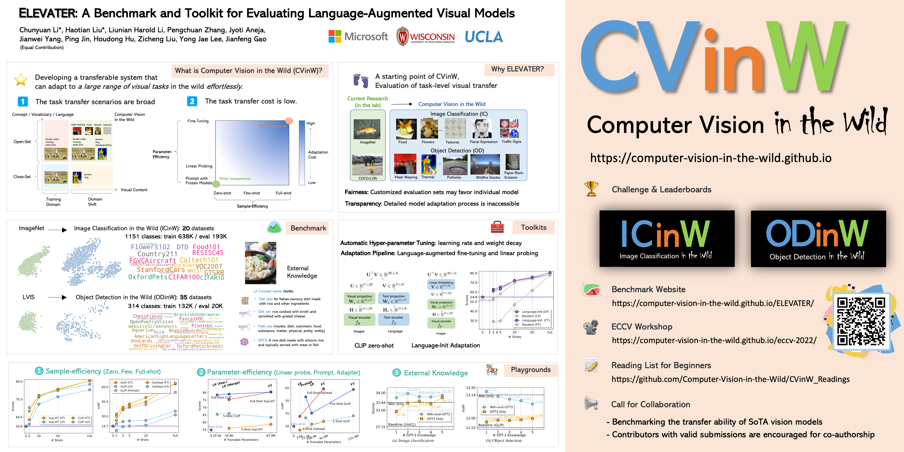

# ELEVATER-Benchmark
The repository for the ELEVATER Benchmark website

Website: https://computer-vision-in-the-wild.github.io/ELEVATER/

  

@article{li2022elevater,
    title={ELEVATER: A Benchmark and Toolkit for Evaluating Language-Augmented Visual Models},
    author={Li, Chunyuan and Liu, Haotian and Li, Liunian Harold and Zhang, Pengchuan and Aneja, Jyoti and Yang, Jianwei and Jin, Ping and Hu, Houdong and Liu, Zicheng and Lee, Yong Jae and Gao, Jianfeng},
    journal={Neural Information Processing Systems},
    year={2022}
}
